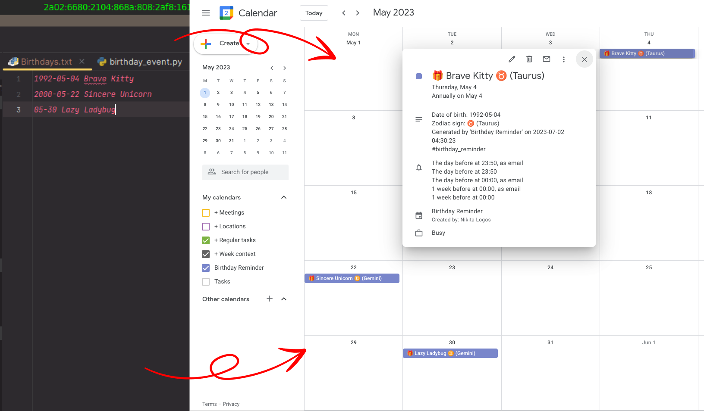

# Birthday Reminder

Convert your text-file birthdays into a Google Calendar, complete with annual events, notifications, handling of February 29th, zodiac signs, and more!

## About

Google Calendar is a powerful app, but it can be difficult to get through it's complex and bulky interface. 
Also creating individual events can be a tedious and frustrating task. 

This simple tool is created to simplify the management of birthday events in Google Calendar. 
You just create a plain-text file with birthdays like that: `1990-01-01 Brave Kitty`, and `birthday-reminder` creates a new calendar based on this file. 
If you edit the file in the future, just run `birthday-reminder` again to update the calendar and that's it!

## File format

File format is very simple:
1. Each line is a record with two fields: `date` and `title` separated by whitespace
2. text after `#` is considered a comment and is ignored
3. empty lines are ignored
4. whitespace before and after `date` and `title` is ignored

Example:
```sh
# this is a comment
2000-01-01 John Doe # this is also a comment
  2000-01-02 Jane      # leading/trailing tabs/spaces are ignored
02-03 Alex # date can be specified without year
  
2000-01-03 # error, title is missing
Alex # error, date is missing
```

## Features

Birtday reminder has pretty good default params, so you can just use it without configuration at all, but you may want to customize it. 
Here I will tell you about the features and how you can configure them. 
For more information, please see [default_config.yaml](./birthday_reminder/configs/default_config.yaml) (or `main_config.yaml`, which will be created on installation)


 1. `title_prefix` and `title postfix` - adds constant text before person's name, like "Birthday of ....", "....'s birthday", etc.
 2. `use_zodiac_signs`, `use_zodiac_names` - enable adding zodiac info to the event title like that: "Birthday of John Doe ♑ (Capricorn)"
 3. `use_time` - choice between two options: full-day events (that last 00:00-23:59) and timed events - where you can choose `event_time` and `event_duration`.
     1. Note that time and duration are common for all events within the calendar. Individual time setting is not implemented for the sake of simplicity.
 4. `remind_29_feb_on_1_mar` - when somebody has a birthday on February 29th, there is a question - in what day to celebrate a birthday in non-leap year. In `birthday-reminder` there are two options - to set event either on February 28th or on March 1st. If `remind_29_feb_on_1_mar` is set to `false`, the first option is applied. If set to `true` - the second one.
 5. `popup_reminders_minutes`, `email_reminders_minutes` - google can either notify you about event via popup on your phone or via email. You can set up to 5 reminder per event. Here reminder times are specified in minutes before the start of the event (negative values don't work). 
     1. You may need to use your calculator to compute the amount of minutes in day or in a week, so here are the shortcuts: `1 day = 1440 min`, `1 week = 10080 min`


## Unicode issues

This program uses emojis, which are Unicode symbols. 

If you are on Windows 10 and earlier, unicode symbols may not show correctly in the command line. 
To avoid this, you can run `birthday-reminder.exe` from Git Bash terminal, or just do nothing. 
Regardless of command line display issues, emojis would be correctly uploaded to Google Calendar.

Also make sure that your config file and file with birthdays are in `UTF-8` encoding. 
If you use files provided with executable, they are fine, but if you specify your custom files, should pay attention to it.
The simplest way to create a file in the correct encoding is to copy file provided in release package and put it in the desired location.

## Install CLI

### Download executable

1. Navigate to [Releases page](https://github.com/nikitalogos/birthday_reminder/releases)
2. Select distribution for your operation system and download it
3. Unpack folder and put it to a place of your choice
4. To run the application you need:
   1. on Windows - double-click on `birthday-reminder.exe` (or open a terminal and execute `birthday-reminder.exe`)
   2. on Linux / MacOS - open a terminal and execute `./birthday-reminder -h`

### Install from source

Tested on Ubuntu 22.04, but should work on Linux and MacOS.

1. Put this directory to the place where all your programs live. Do not move it after installation or links will break!
2. Enter the directory `cd birthday_reminder`
3. Run `make install_python` to setup Python3 environment. What it does:
   1. installs packages `python3.11` and `python3.911-venv` 
      1. (if you want to use it with different version of python, you can edit `Makefile`. However, it may not work with older versions of python
   2. creates virtual environment `venv` in directory `birthday_reminder`
4. Run `make install` to install. What it does:
   1. creates directory `auth` with proper rights
   2. generates files `main_config.yaml` and `Birthdays.txt`
   3. creates executable `/usr/local/bin/birthday-reminder` that runs code from the current repository
5. Restart your shell to make autocompletion for command name work
6. Run `birthday-reminder --help`

If you want to contribute, you may also want to install pre-commit hook: `make install_git_pre_commit_hook`

> Developer note: `make install` installs package in editable mode, so you can edit code and `birthday-reminder` will use the updated version

#### Uninstall from source

1. Remove python3.11 if you do not need it (which is unlikely) - `sudo apt-get uninstall python3.11 python3.11-venv`
2. Run `make uninstall`
3. delete this repository folder

## Configure

1. you can modify all params in file `main_config.yaml`
   1. File `main_config.yaml` is created during installation. It has detailed description of all params.
2. you can also pass these params as command line arguments. CLI arguments have higher priority than config file. 
   1. If you want, you can specify a custom config file location with CLI argument `--config-file`
3. However, I don't recommend to use CLI arguments, because they are not as intuitive as YAML syntax.

## Authorize in Google Calendar API

To connect `birthday-reminder` to your Google Calendar, you need to authorize in Google Calendar API.

### Get credentials

First, you need to obtain credentials.

Here is the detailed visual guide how to do it: [super_detailed_guide_through_google_api.pdf](./docs/super_detailed_guide_through_google_api.pdf)

Here is the short text version:
1. Go to the [Google API Console](https://console.cloud.google.com/)
2. Create a new project `birthday-reminder`
3. Enable `Google Calendar API` for the project
4. Go to the `Credentials` section on the left navigation bar
5. Click on `Configure Consent Screen`
   1. Go through the steps to configure your consent screen
   2. It's important to choose `auth/calendar` scope
6. Click on `Create Credentials` and select `OAuth client ID`
   1. Select `Web application` as your Application type 
   2. Set up your `Authorized redirect URIs`. Type this string exactly: `http://localhost:58585/`
7. You'll get a `client_id` and `client_secret` — these are important for your project to connect to the API. 
   1. Press `Download json` and download `.json` file with your credentials

### Save credentials

1. Rename downloaded file to `google_secret.json`
2. Put it to the directory `auth` in the root of the project.


## Usage

1. You can add birthdays to the `Birthdays.txt` file, which is created during installation. 
   1. You can specify a custom file location by editing parameter `input_file` in `main_config.yaml`
2. To check if file is valid, run `birthday-reminder validate`
3. To show birthdays from file, run `birthday-reminder show next` - this will show birthdays sorted by number of days to the next birthday.
   1. The other sort options are:
      1. `show date` - sorted by month and day
      2. `show year` - sorted by year of birth (dates without known year will show up in the end)
4. To show birthdays from Google Calendar, run `birthday-reminder gshow next`.
   1. To run this command, you first need to authorize in Google Calendar. (See the previous section for details)
5. To show diff between file and Google Calendar, run `birthday-reminder diff`
6. To upload birthdays from file to Google Calendar, run `birthday-reminder upload`
   1. This command first will show `diff` between file and Google Calendar, explain what changes it's going to make and ask for confirmation
   2. Upload supports optional flags: 
      1. `-y` / `--yes` - do not ask for confirmation
      2. `-f` / `--force` - delete all events in Google Calendar and upload all events from file

> **Note:** 
> 1. `birthday-reminder` will create a new calendar in your Google Calendar called `Birthday Reminder` (you can change this name in `main_config.yaml`).
> 2. It will not modify any events from other calendars. 
> 3. Calendar created by `birthday-reminder` is not intended to be edited manually from Google Calendar web interface. 
> 4. The only things you can do in web interface are
>    1. change the color of the calendar (unfortunately, it's not possible to change the color via API).
>    2. set the default calendar time zone. (also does't work through API). It is useful if you choose full-day events option (`use_time: false`), because full-day events follow the calendar time zone. Timed events, however, follow the time zone of the event itself, which is effectively set by the `birthday-reminder` program.
> 5. If you want to edit events, you should edit `Birthdays.txt` file and run `birthday-reminder upload` again.

## Advanced usage

1. If you want, you can create several birthday calendars with different preferences. For example, one for friends and one for colleagues.
2. To do this, you need to create two separate config files, then configure each calendar accordingly. 
3. `birthday-reminder` distinguishes calendars by their names, so just set different values in `calendar_name` field.
   1. Be careful and do not set the same name as your existing calendar, otherwise `birthday-reminder` can potentially delete all events from it! 
   2. However, it will ask for confirmation before doing this (if `--force` parameter is not specified).
4. also set fields `input_file` in both config to point to corresponding text files with your birthdays data
5. After that, you can run `birthday-reminder <command>` with `--config-file` (or simply `-c`) parameter to specify which config file to use.